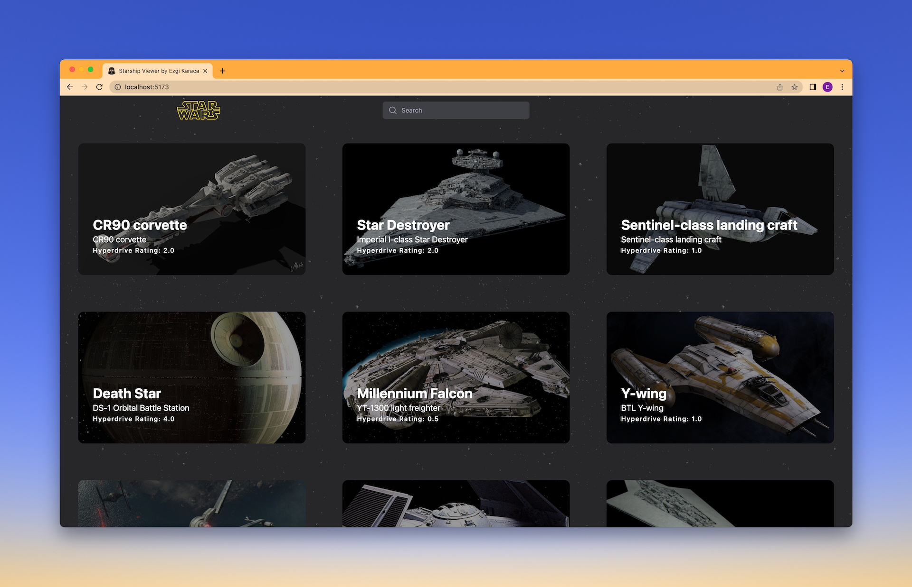
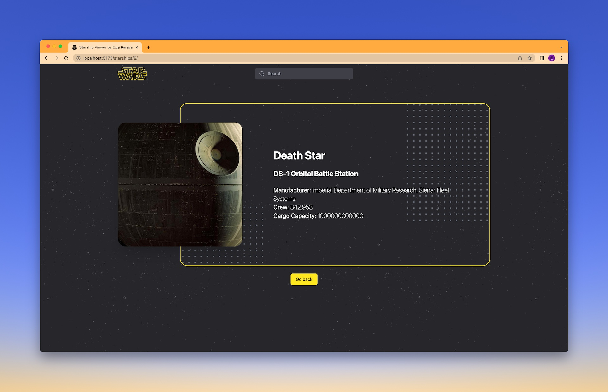
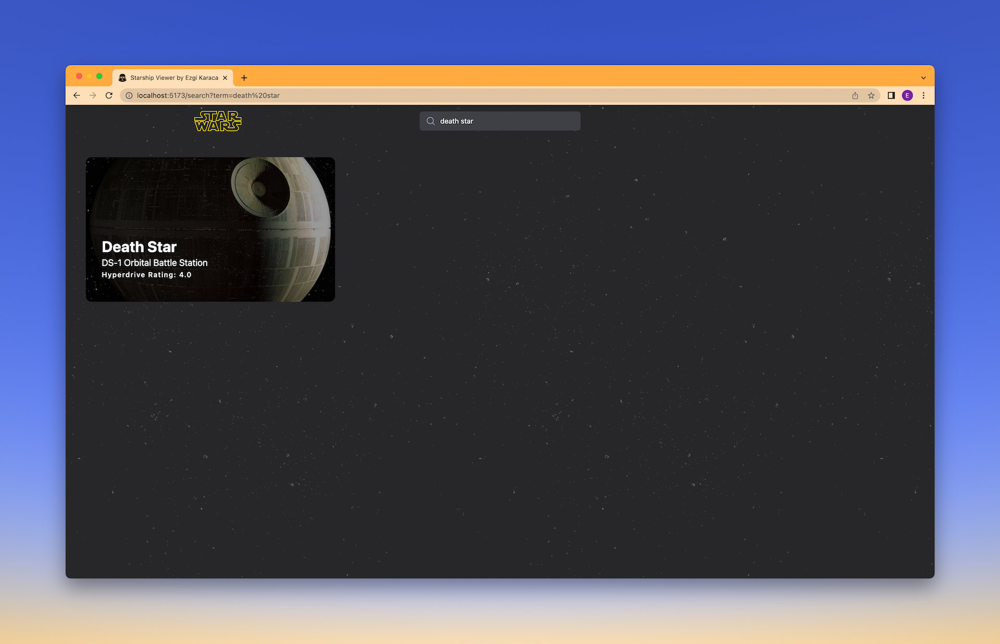
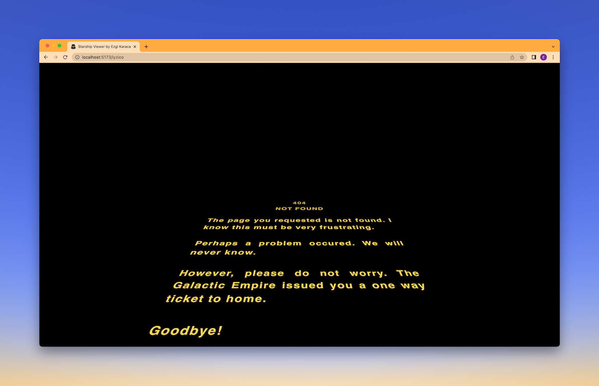
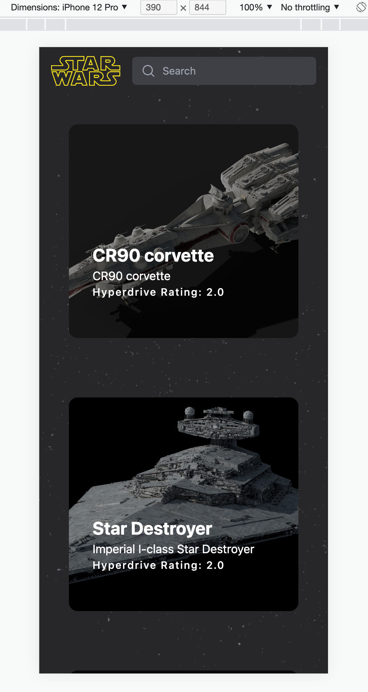
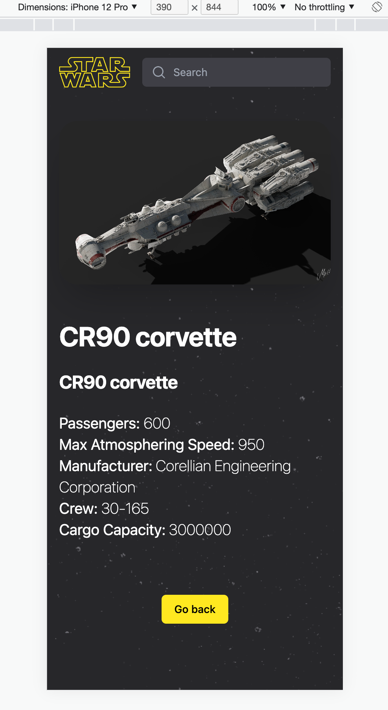

# Starship Viewer

Starship Viewer is a React.js application; where it utilized https://swapi.dev/ to implement several features, such as:

- Listing starships
- Search among Starships
- Read details of a specific starship
- Load more starships with a load more button

The main technologies this project is using:

- **React** as the main framework
- **Tailwind** for all the styling
- **Vite** for frontend tooling, and packaging
- **Vitest** for testing
- **React Router** for route, navigation, and templating
- **Axios** for API fetching

PS: Due to entropy, I didn't use any environment variables because I want to keep the project as is. That is why, you may found the API URLs hard coded. So, in the future, I can run with no maintenance. Please take that into consideration!

## Instructions

The project can run with a simple command.

```
yarn && yarn dev
```

This will open up the project in your localhost, most probably by the default port Vite providing with, which is `http://localhost:5173/`.

To run tests:

```
yarn test
```

is simply enough.

---

## Screenshots

### Home



### Detail



### Search



### Not Found



### Mobile responsive home



### Mobile responsive search



---

Thanks for checking out.

### Project by Ezgi Karaca
